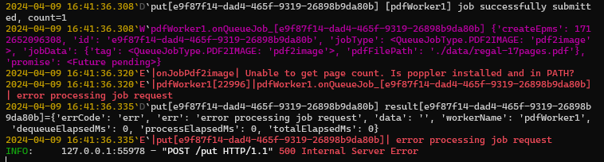
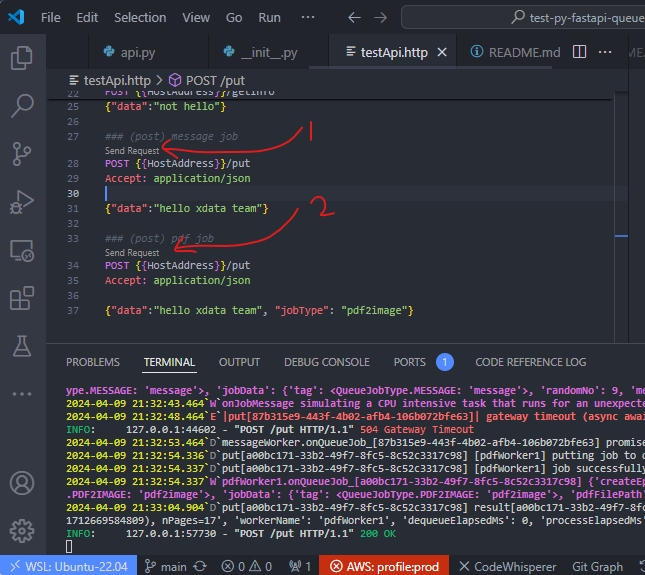

## Overview
A repo to demonstrate how to use Python to construct a FastAPI Server using advanced async and multi-threading approach.  There are a few highlights.
- Construct the API endpoint in async function
- The async API receives request payload and enqueue the item to thread safe worker queues.
- After job submission, it waits for the result using `await`, i.e. wait in async way.  
  Thus, the request will **NOT** block the main thread, which means new incoming requests will **NOT** be blocked.
- Each workers, running in separated worker thread, and dequeue the job item and process it sequentially.
- Each worker processes the job like simulating a CPU intensive task that may run for a few seconds.  
  Even though the worker may block itself during the job processing, it will **NOT** block the main thread and other worker threads.
- Job item is a TypeDict that includes data payload and a `asyncio.Future` object similar to JavaScript `promise`.  When the worker finishes the job processing, it will notify the result to the original API who is awaiting for the result.  
- If API finds the worker queue is already full, i.e. too many pending jobs, it may return HTTP status code `503 service unavailable`. 
  
## Use cases
- This repo demonstrates how multiple workers that are able to work with incoming requests concurrently.  
- There are two types of demo workers.
  - The first one is called `messageWorker` and there is one worker thread for this type.  
    This worker simulates CPU intensive task, either running for 3 or 10 seconds.
  - The other type is called `pdfWorker` and there are 8 x worker threads, which means max 8 x concurrent CPU intensive task can run in parallel.  This worker simulates CPU intensive task that a [17-page pdf](./data/regal-17pages.pdf) are converted into png files.
  > NOTE: each worker has its own job queue
- The methodologies of this repo may be applied to some use case like `PaddleOCR` or `pdf-to-image` processing which are CPU intensive tasks by nature, but the processing should **NOT** block incoming http requests.

## Performance stats - single and multiple pdf workers
- The test is performed
  - Hardware config: AMD Ryzen 9 7940HS / 32GB RAM / Average CPU Mark: 30524
  - no. of pdf workers = 8
  - pdf file: [17-page pdf](./data/regal-17pages.pdf)
  - output png dir: `./out/pdf2image/<uuid>/<image.NN>.png`
  - OS: WSL/Ubuntu 22.04.x
- Statistics processing 8 x pdf by 8 x workers concurrently.  The average processing time is around 7sec, which is very impressive.
- Since it takes around 6 sec to process 1 x pdf by 1 x worker, this means multiple workers can achieve fast concurrent processing.  
  

## HTTP status code
- `500` internal server error
- `504` gateway timeout, e.g. API request timeout waiting for worker result
- `503` service unavailable, e.g. API request finds out job queue already full 
- `429` too many requests, e.g. API has been requested exceeding the rate limit, e.g. an user has 60+ requests in the last min.

## About `async`/`await` and `asyncio.Future`
- First, `async`/`await` constructs are only applicable to I/O bound functions which will **NOT** block main thread.
  It does **NOT** work for CPU intensive tasks.
- `asyncio.Future` is an instance created by `asyncio.Future()`.  It is similar to JavaScript `Promise` that it can be awaited for result that will happen at later time.  The `await` will be returned if the `asyncio.Future` object is assigned with result or exception.  
   For example, `futureResult.set_result(True)` will set result to `True` and thus release the `await`.
- `asyncio.Future` is very useful in job queue approach since the job completion time in unknown.
- Since the `await` will **NOT** return until the `asyncio.Future` is done with result or exception, it should impose a timeout check or it will await forever.  
  ```python
  try:
     async with asyncio.timeout(MAX_WAIT_SEC):
         result = await promise
  except asyncio.TimeoutError as e:
      U.logPrefixE(prefix, "timeout waiting for the result")
  ```  
  NOTE: when timeout happens, the `asyncio.Future` object is auto set to `canceled`.
- The timeout check is particularly important to API endpoint because gateway timeout `504` should be responded to the client or the client will wait like hanging.  If the `asyncio.Future` object has `canceled` because of timeout, the worker should detect this status and discard the job.

## Environment
- Python `3.11.8`
- `WSL/Ubuntu` 22.04.x or `Windows` 
- Dependent utility - poppler
  - For linux/Ubuntu, `sudo apt install -y poppler-utils`
  - For Windows, install the release page [here](https://github.com/oschwartz10612/poppler-windows/releases) from the repo [poppler-windows](https://github.com/oschwartz10612/poppler-windows) 
  - If `poppler` is not installed, you will see error message sending http post request to `/put`   
    
- virtualenv using pyenv (Linux/Ubuntu)
  ```bash
  $ pyenv update
  $ pyenv install 3.11.8
  $ pyenv virtualenv 3.11.8 test-py-fastapi-queue
  $ pyenv activate test-py-fastapi-queue
  ```
- virtualenv using py (Windows)
  First, install python [3.11.8](https://www.python.org/downloads/release/python-3118/)
  ```bat
  > cd <projectDir>
  > py -3.11 -m venv winEnv
  > winEnv\Scripts\activate
  ```
- Install packages on virtualenv
  ```bash
  $ pip install -r requirements.txt
  ```

## About fastapi package
- It is suggested to install by `pip install fastapi[all]` as it will include extra dependent packages like `uvicorn` and `uvloop` for optimal async performance
- This repo is based on a specific version `fastapi[all]==0.110.1`.  
  For details, refer to [requirements.txt](./requirements.txt)

## vscode extension
- Commonly used extension for Python  
  - python   
    `ext install ms-python.python`   
  - pylance  
    `ext install ms-python.vscode-pylance`   
  - Black Formatter  
  - `ext install ms-python.black-formatter`   
- REST Client (like postman)  
  `ext install humao.rest-client`

## Run the API server and how to test it
- First and foremost, check python version, installed packages and dependent `poppler`
- Activate the virtualenv
- Run the API server by `python src/main.py`
- `testApi.http` is the file to test APIs using extension `REST Client`  
- For example:  
  - Click `Send Request` (arrow "1") to send HTTP POST request to `messageWorker` (simulate CPU intensive task, running in 3 or 10secs) 
  - Click `Send Request` (arrow "2") to send HTTP POST request to `pdfWorker` (convert pdf to images)

  

## References
- https://superfastpython.com/thread-queue/
- https://superfastpython.com/thread-producer-consumer-pattern-in-python/ 
